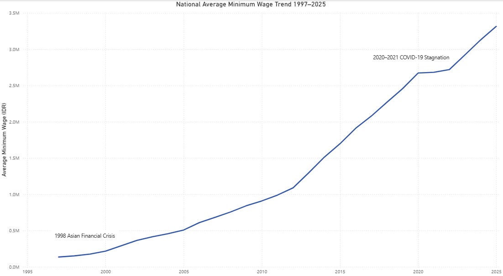
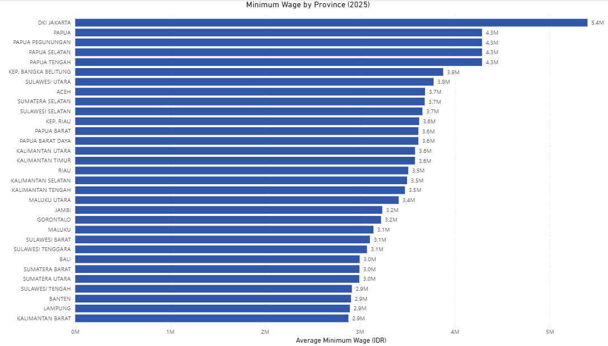
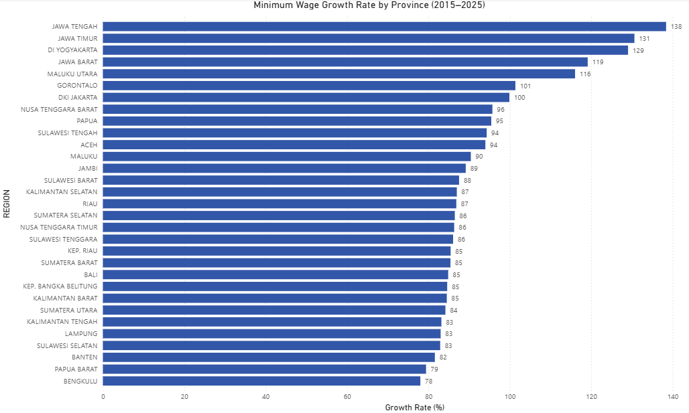
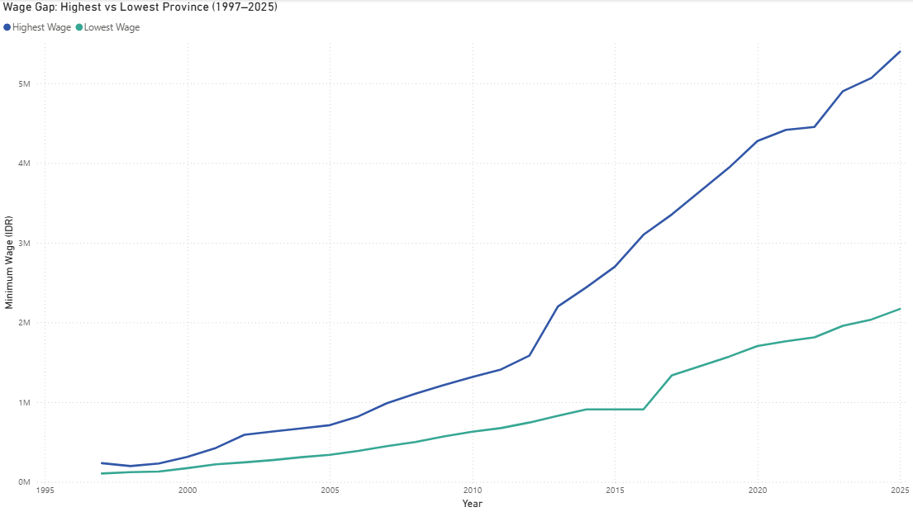

# 🇮🇩 Indonesia Regional Minimum Wage Analysis (1997–2025)

## Project Overview
This project analyzes **28 years of Indonesia's regional minimum wage (UMR/UMP)** data across all provinces. The analysis covers national trends, provincial comparisons, growth rates, and wage inequality over time. An interactive dashboard was built using **Power BI** to visualize key findings.

---

## Dataset
The dataset contains minimum wage records for all Indonesian provinces from 1997 to 2025.

| Column | Description |
|--------|-------------|
| `REGION` | Province name |
| `YEAR` | Year of the minimum wage record |
| `SALARY` | Minimum wage in Indonesian Rupiah |

- **Total records:** 983 rows
- **Provinces covered:** 42 regions
- **Time span:** 1997–2025 (28 years)

> ⚠️ The raw dataset contained data entry errors (missing digits, extra zeros). All errors were identified and corrected before analysis.

---

## Key Questions
1. How has Indonesia's national average minimum wage trended over 28 years?
2. Which provinces have the highest and lowest minimum wages in 2025?
3. Which provinces experienced the fastest wage growth between 2015 and 2025?
4. How has the wage gap between the highest and lowest-paid provinces changed over time?

---

## Tools Used
- **Microsoft Excel** — Data cleaning and preprocessing
- **Power BI Desktop** — Dashboard and interactive visualizations
- **GitHub** — Documentation and version control

---

## Data Cleaning Process
The raw dataset had several issues that were corrected before analysis:

1. **2023 data errors** — All 35 provincial values had extra digits (e.g., `340,417,724` → `3,404,177`). Fixed by dividing values by 10 or 100 depending on magnitude.
2. **2024 INDONESIA row** — National average was incorrectly entered with extra digits. Corrected by dividing by 100.
3. **2017 Kalimantan Timur** — Value was `339,556` (missing leading digit). Corrected to `2,339,556` based on surrounding years' trend.

---

## Dashboard Pages

### 📈 Page 1 — National Trend
Displays the national average minimum wage from 1997 to 2025 as a line chart. Notable events such as the **1998 Asian Financial Crisis** and **2020–2021 COVID-19 stagnation** are annotated on the chart.

---

### 🗺️ Page 2 — Provincial Comparison
Horizontal bar chart comparing minimum wages across all provinces in **2025**. DKI Jakarta leads at **IDR 5.4M**, while Lampung and Kalimantan Barat are among the lowest.

---

### 📊 Page 3 — Growth Rate
Bar chart showing the **minimum wage growth rate (%) per province from 2015 to 2025**. Highlights which regions have seen the most aggressive wage increases over the past decade.

---

### 📉 Page 4 — Wage Gap
Dual line chart tracking the **highest vs lowest provincial wage** each year from 1997 to 2025. The gap has widened significantly since 2013, reflecting growing regional wage inequality.

---

## Key Insights

**📌 Consistent national wage growth**
Indonesia's national average minimum wage grew from ~IDR 135,000 in 1997 to ~IDR 3,300,000 in 2025 — a roughly 24x increase over 28 years.

**📌 COVID-19 caused near-zero growth in 2021**
The 2020–2021 period shows a clear stagnation in wage growth across most provinces, reflecting the economic impact of the pandemic.

**📌 DKI Jakarta consistently leads**
Jakarta has maintained the highest minimum wage throughout the entire dataset period, reaching IDR 5.4M in 2025.

**📌 Wage inequality is widening**
The gap between the highest and lowest provincial wages has grown significantly since 2013, driven by faster growth in resource-rich and urban provinces.

**📌 Java provinces have slower growth rates**
Despite being the economic center, provinces like Jawa Tengah and DI Yogyakarta show relatively lower growth rates compared to outer island provinces.

---

## How to View the Dashboard
1. Download the `.pbix` file from this repository
2. Open it using [Power BI Desktop](https://powerbi.microsoft.com/desktop) (free)
3. Explore all 4 dashboard pages interactively
